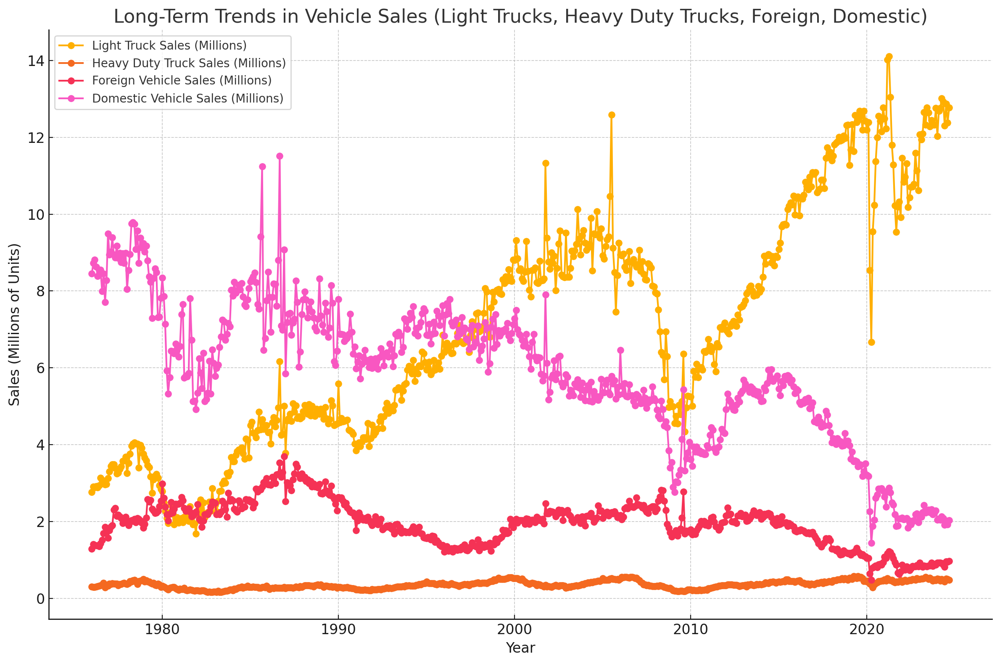
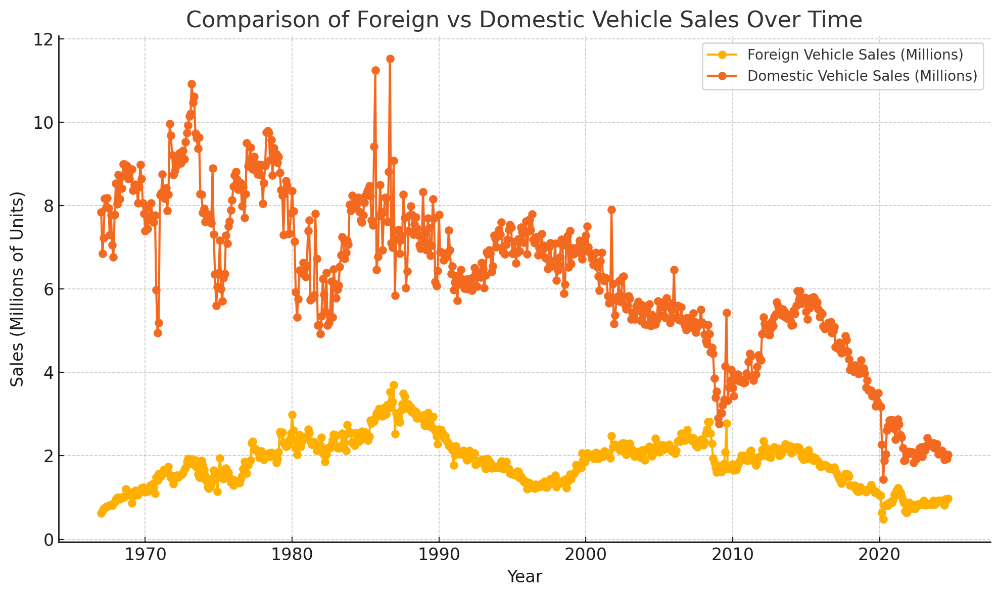

# Automotive Sales Analysis

Overview

This project presents a comprehensive analysis of long-term trends and patterns in automotive sales, with a particular focus on different vehicle categories such as light trucks, heavy-duty trucks, and the comparison between domestic and foreign vehicle sales. The analysis uses various visualizations to highlight key trends and market dynamics over time.

Table of Contents

Data Sources
Analysis and Visualizations
Key Insights
Usage
Contributing
License
Contact
Data Sources

The analysis is based on sales data compiled from the following categories:

Total Vehicle Sales
Light Weight Truck Sales
Domestic and Foreign Sales
Heavy Duty Truck Sales
Foreign Motor Vehicle Sales
Foreign Light Truck Sales
Domestic Light Truck Sales
Domestic Auto Vehicle Sales
Autos and Light Trucks Sales
Auto Inventory-to-Sales Ratio
Data is organized in an Excel file named combined sales.xlsx and broken down into multiple sheets for detailed exploration.

Analysis and Visualizations:

## Analysis and Visualizations

1. **Long-Term Trends in Vehicle Sales**
   
   This chart illustrates the sales trends of light trucks, heavy-duty trucks, foreign vehicles, and domestic vehicles from 1970 to the present, highlighting significant shifts and patterns.

2. **Auto Inventory-to-Sales Ratio vs Total Vehicle Sales**
   
   A dual-axis chart comparing the inventory-to-sales ratio and total vehicle sales over time, showing how inventory levels impact overall sales.

3. **Seasonal Patterns in Vehicle Sales by Month**
   
   This graph shows the average monthly sales for various vehicle categories, demonstrating any existing seasonal trends.

4. **Domestic vs. Foreign Light Truck Sales Over Time**
   
   A comparison of domestic and foreign light truck sales over several decades, emphasizing the growth or decline in each category.

5. **Domestic vs. Foreign Vehicle Market Share Over Time**
   
   This visualization outlines the market share trends of domestic versus foreign vehicles, highlighting changes in consumer preferences.

6. **Correlation Matrix of Vehicle Sales Categories**
   
   A heatmap showing the correlation between different vehicle sales categories, providing insights into which types of vehicle sales are related.

7. **Domestic to Foreign Sales Ratios for Light Trucks and Autos Over Time**
   
   This chart shows the ratio of domestic to foreign sales for light trucks and autos, illustrating how the balance between domestic and foreign sales has evolved.

8. **Comparison of Foreign vs. Domestic Vehicle Sales Over Time**
   
   A side-by-side comparison of foreign and domestic vehicle sales, emphasizing key trends and shifts over the years.

The following visualizations were created as part of this analysis:

Long-Term Trends in Vehicle Sales: This visualization illustrates the trends for light trucks, heavy-duty trucks, foreign vehicle sales, and domestic vehicle sales, showcasing fluctuations and major shifts in consumer preferences over the years.
Auto Inventory-to-Sales Ratio vs Total Vehicle Sales Over Time: A dual-axis chart comparing the inventory-to-sales ratio with total vehicle sales, emphasizing periods of inventory buildup or shortages relative to sales volumes.
Seasonal Patterns in Vehicle Sales by Month: An analysis of average sales per month for different vehicle categories, highlighting seasonal variations.
Domestic vs. Foreign Light Truck Sales Over Time: This graph contrasts domestic and foreign light truck sales, revealing shifts in market share and consumer demand.
Domestic vs. Foreign Vehicle Market Share Over Time: An exploration of how market share percentages have evolved between domestic and foreign vehicles.
Correlation Matrix of Vehicle Sales Categories: A heatmap illustrating correlations between different vehicle sales categories, providing insights into the relationships among them.
Domestic to Foreign Sales Ratios for Light Trucks and Autos Over Time: A ratio analysis comparing domestic and foreign sales of light trucks and autos.
Comparison of Foreign vs. Domestic Vehicle Sales Over Time: A visualization that contrasts the overall sales trends of foreign and domestic vehicles.
Key Insights

Shift in Consumer Preferences: There has been a noticeable increase in the popularity of light trucks over the years, while sales of heavy-duty trucks and domestic autos have shown varying trends.
Inventory Dynamics: Periods of high inventory-to-sales ratios often precede or coincide with shifts in sales performance, indicating possible supply chain or market demand adjustments.
Seasonal Trends: Vehicle sales exhibit seasonal patterns, with certain categories showing more stability throughout the year.
Market Share Evolution: Domestic vehicles have gradually lost market share to foreign vehicles, although there have been periods of stabilization or recovery.
Usage

To explore the analysis, use the provided Excel file and Python scripts (or equivalent BI tools) to recreate or extend the visualizations.
The analysis can be a useful resource for understanding historical sales trends and forecasting future performance.
Contributing

